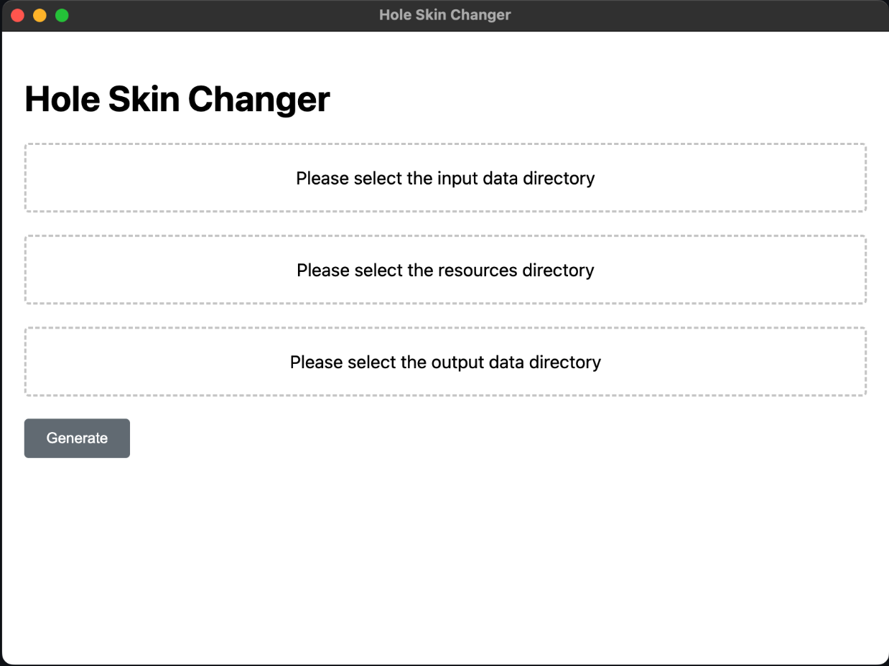
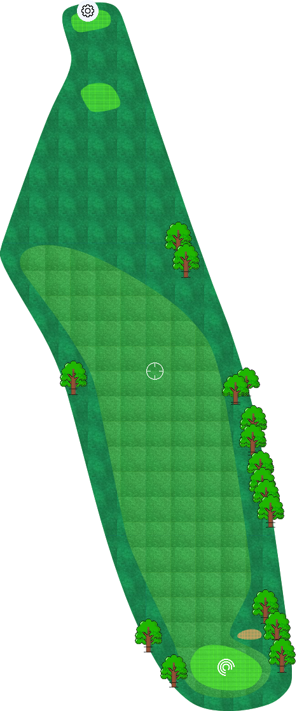

## Project Overview

This project is a tool to visualize a golf course, the input is a json file containing the 2d coordinates of the golf
course,
including green, fairway, tee, bunker, water, and hole boundary. The output is a 2d map of the golf course.

## Key requirements

- the output image should be accurately represent the coordinates of the golf course
- the output image should be visually appealing

## Project Structure

- `src/`: source code
- `input_data/`: stores json file that contains the golf course layout
- `output_data/`: stores the generated images
- `resources/icons/`: stores the icons used to represent the markers
- `resources/textures/`: stores the textures used to represent the polygons
- `resources/colors.xml`: stores the colors used to represent the lines

## Set up Python Environment

```bash
python -m venv venv
source venv/bin/activate
pip install -r requirements.txt
```

## How to setup and run

### Install nvm, node, npm, etc

```bash
# step 1: download and install nvm
curl -o- https://raw.githubusercontent.com/nvm-sh/nvm/v0.40.1/install.sh | bash

# step 2: set nvm environment variable
export NVM_DIR="$HOME/.nvm"
[ -s "$NVM_DIR/nvm.sh" ] && \. "$NVM_DIR/nvm.sh"
[ -s "$NVM_DIR/bash_completion" ] && \. "$NVM_DIR/bash_completion"

# step 3: install node
nvm install --lts
nvm use --lts

# step 4: check
node --version
npm --version

# step 5: read package.json and install dependencies
# sudo npm cache clean -f # only if have issues running `npm install`
npm install
npm update
```

### Install python dependencies

```bash
# step 1: install poetry
curl -sSL https://install.python-poetry.org | python3 -

# step 1(alternative if use .venv)
source .venv/bin/activate
pip install poetry

# step 2: install dependencies
poetry install --no-root

# step 3: activate virtual environment
env activate

# step 4(optional): add more dependencies if needed
# poetry add numpy scipy
```

### Test python code

- run the python test cases

```bash
poetry run pytest src/python/test.py -v
```

- the test cases will load files from /src/python/testcases/input/ and save the processed files to /src/python/testcases/output/

### Test frontend code(bug to fix)

- run the frontend code

```bash
npm start
```

## UI and outputs

### the designer just need to specify the following paths:

- input_data/
- output_data/
- resources/



one example of the output course map is shown below:



### Package

```bash
npm run build
```
