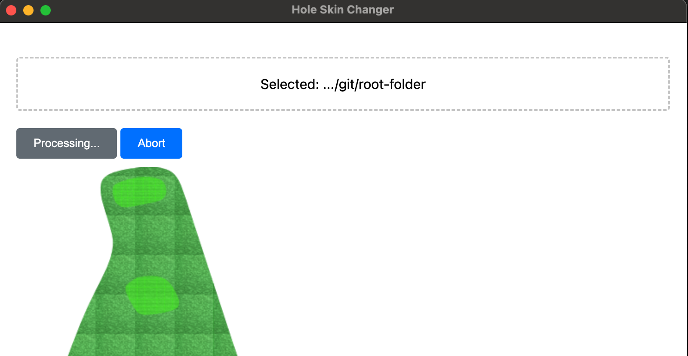

## Project Overview

This project is a tool to visualize a golf course, the input is a json file containing the 2d coordinates of the golf
course,
including green, fairway, tee, bunker, water, and hole boundary. The output is a 2d map of the golf course.

## Key requirements

- the output image should be accurately represent the coordinates of the golf course
- the output image should be visually appealing

## Project Structure

- `src/`: source code
- `input_data/`: stores json file that contains the golf course layout
- `output_data/`: stores the generated images
- `resources/icons/`: stores the icons used to represent the markers
- `resources/textures/`: stores the textures used to represent the polygons
- `resources/colors.xml`: stores the colors used to represent the lines

## Set up Python Environment

```bash
python -m venv venv
source venv/bin/activate
pip install -r requirements.txt
```

## Run the project


and the output will be saved in the `output_data/` folder.


## UI and outputs

### the designer just need to specify the following paths:
- input_data/
- output_data/
- resources/



one example of the output course map is shown below:


